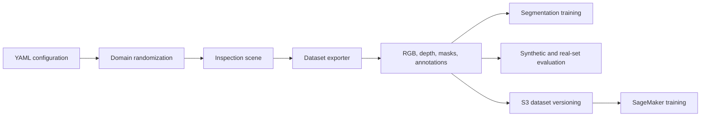

# Architecture

This project is organized as a reproducible synthetic-data pipeline for robotic surface-defect inspection.

## Pipeline



## Components

`synthetic_inspection.config`
: Loads experiment settings and output paths from YAML.

`synthetic_inspection.randomization`
: Samples lighting, camera, material, and defect parameters from bounded configuration ranges.

`synthetic_inspection.isaac_scene`
: Provides the Isaac Sim execution path and environment checks for simulation-based rendering.

`synthetic_inspection.exporter`
: Writes RGB images, depth arrays, segmentation masks, COCO-style annotations, and a dataset manifest.

`synthetic_inspection.training`
: Trains a compact semantic segmentation baseline on generated masks.

`synthetic_inspection.metrics`
: Summarizes annotation coverage and compares synthetic-versus-real evaluation metrics.

`synthetic_inspection.cloud`
: Uploads versioned datasets to Amazon S3.

`synthetic_inspection.cloud_training`
: Launches SageMaker PyTorch training from the uploaded dataset.

## Data Contract

Generated datasets follow this structure:

```text
dataset_root/
  rgb/
    000001.png
  depth/
    000001.npy
  masks/
    000001.png
  annotations/
    instances.json
  manifest.json
```

This structure keeps local training, cloud upload, and evaluation scripts independent from the rendering backend.

